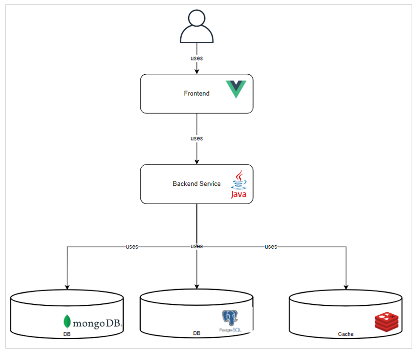
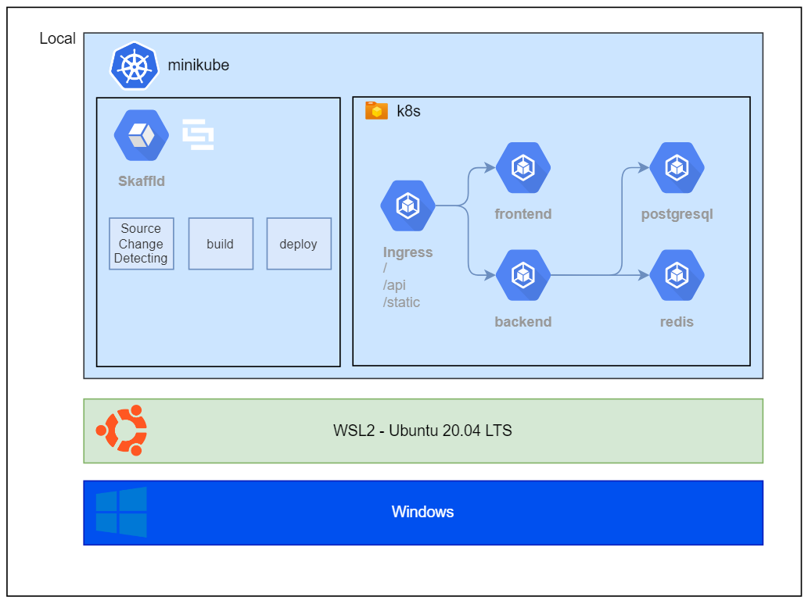
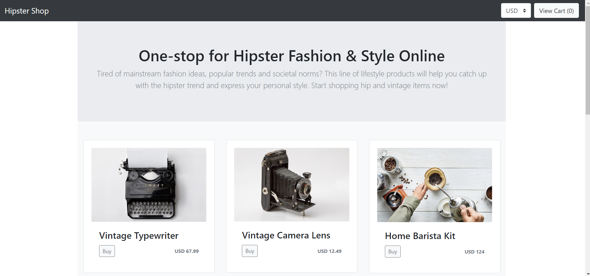

# eshop legacy 구조도



<br>



<br>

# eshop 화면



<br>

# eshop legacy 환경 실습

root 폴더의 docker-compose.yml 과 frontend 폴더의 Dockerfile 을 remote 환경에 맞게 수정하여
docker-compose up -d 로 실행

## docker-compose.yml

아래 23번째, 32번째 라인 <<변수>>부분은 개인 환경에 맞게 수정 필요

```bash
(...생략...)
23    image: <<개인 Backend ECR URI>>:<<개인 Backend Image Tag>>
(...생략...)
32    image: <<개인 Frontend ECR URI>>:<<개인 Frontend Image Tag>>
(...생략...)
```